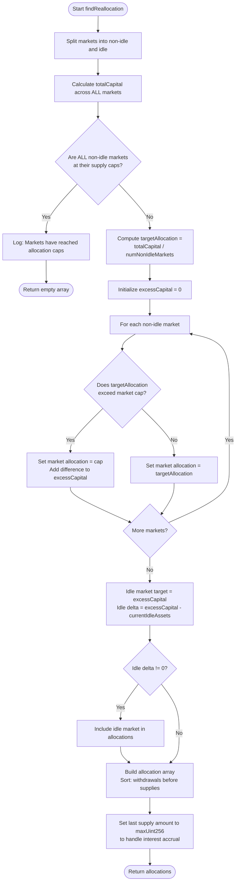

# Equalize Capital Strategy

The EqualizeCapital strategy ensures that all non-idle markets in a vault have an equal allocation of capital, while respecting individual market supply caps. Capital that cannot fit in non-idle markets (due to supply caps) is routed to the idle market.

## Logic Flow

## Key Logic Steps

1. **Check if all non-idle markets are capped**: If every non-idle market has reached its supply cap, log a message and return an empty allocation array (no reallocation needed).

2. **Calculate total capital**: Sum the `vaultAssets` across ALL markets, including the idle market.

3. **Compute equal allocation**: Divide total capital by the number of non-idle markets to get the target allocation per market.

4. **Respect supply caps**: For each non-idle market:
   - If `targetAllocation > market.cap`, set allocation to `cap` and add the difference to `excessCapital`
   - Otherwise, set allocation to `targetAllocation`

5. **Compute idle market target**: The idle market's target is `excessCapital` (capital that couldn't fit in non-idle markets due to caps).
   - If no markets are capped: idle target = 0 (all capital goes to non-idle markets)
   - If some markets are capped: idle target = sum of excess from capped markets
   - **Idle delta** = `excessCapital - currentIdleAssets` (can be negative, meaning withdrawal from idle)

6. **Build allocation array**: Sort allocations so withdrawals (negative deltas) come before supplies (positive deltas). This ordering is required because the Morpho contract needs idle tokens available before it can supply to markets.

7. **Handle interest accrual**: The last supply in the allocation array uses `maxUint256` instead of a specific amount. This tells the contract to supply whatever tokens are actually available after withdrawals. This is critical because interest accrues between when we fetch data and when the transaction executes, which would otherwise cause an `InconsistentReallocation` error if the amounts don't match exactly.

## Example

Given:
- Idle market: 50 tokens
- Market A: 30 tokens (cap: 100)
- Market B: 20 tokens (cap: 100)
- **Total: 100 tokens**

Calculation:
- Target per non-idle market = 100 / 2 = 50
- No caps exceeded → excessCapital = 0
- Idle target = 0, idle delta = 0 - 50 = **-50** (withdrawal)
- Market A delta = 50 - 30 = **+20** (supply)
- Market B delta = 50 - 20 = **+30** (supply)

Final allocations (sorted by delta):
1. Idle → 0 (withdraw 50)
2. Market A → 50 (supply 20)
3. Market B → `maxUint256` (last supply uses max to handle interest accrual)
